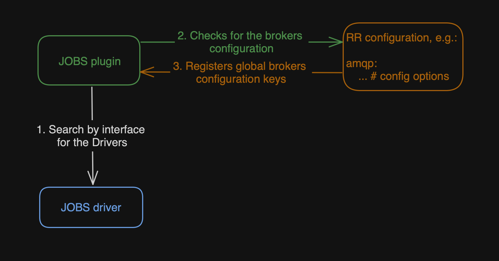

# Jobs driver

JOBS drivers are mini-plugins that are connected to the main JOBS plugin and initialized by it.

## Architecture

While initializing, the JOBS plugin searches for registered drivers by the `Constructor` interface. The `Constructor` and `Driver` (described below) interfaces are declared in the [RR API repository](https://github.com/roadrunner-server/api/blob/master/plugins/v4/jobs/driver.go).

Constructor interface:



```go
// Constructor constructs Consumer interface. Endure abstraction.
type Constructor interface {
 // Name returns the name of the driver
 Name() string
 // DriverFromConfig constructs a driver (e.g. kafka, amqp) from the configuration using the provided configKey
 DriverFromConfig(configKey string, queue Queue, pipeline Pipeline) (Driver, error)
 // DriverFromPipeline constructs a driver (e.g. kafka, amqp) from the pipeline. All configuration is provided by the pipeline
 DriverFromPipeline(pipe Pipeline, queue Queue) (Driver, error)
}
```



Driver interface:



```go
// Driver represents the interface for a single jobs driver
type Driver interface {
 // Push pushes the job to the underlying driver
 Push(ctx context.Context, msg Message) error
 // Run starts consuming the pipeline
 Run(ctx context.Context, pipeline Pipeline) error
 // Stop stops the consumer and closes the underlying connection
 Stop(ctx context.Context) error
 // Pause pauses the jobs consuming (while still allowing job pushing)
 Pause(ctx context.Context, pipeline string) error
 // Resume resumes the consumer
 Resume(ctx context.Context, pipeline string) error
 // State returns information about the driver state
 State(ctx context.Context) (*State, error)
}
```



So every driver should implement the `Constructor` interface to be found by the JOBS plugin. Let's have a look at the methods included in the `Constructor` interface:

1. `Name() string`: This method should return a user-friendly name for the driver. It'll be used later in the pipelines `<pipeline_name>.driver` option. **It is an important option. The name here and name in the pipeline options should match.**
2. `DriverFromConfig(configKey string, queue Queue, pipeline Pipeline) (Driver, error)`: Returns a `Driver` implementation declared via configuration. RoadRunner, in turn, provides a configuration key (such as `jobs.pipelines.pipeline-name.driver-name.config`), the queue implementation to which messages are pushed, and the pipeline with all information about the pipeline. Later we will look at how to use this.
3. `DriverFromPipeline(pipe Pipeline, queue Queue) (Driver, error)`: Returns a `Driver` implementation declared via the RPC `jobs.Declare` call. It doesn't have configuration, but all info and configuration options are stored in the `pipeline` method argument.

### Initialization

During initialization, the JOBS plugin searches for the JOBS drivers and saves them into a hashmap by the name provided by the `Name() string` method.
It is not possible to have two drivers with the same name.
Drivers here are the ones declared in the `jobs.pipelines` configuration.
RoadRunner also saves pipelines declared via configuration by their name. Pipelines can also be declared with the [`jobs.Declare`](https://github.com/roadrunner-php/jobs/blob/v4.5.0/src/Jobs.php#L26) RPC method.
If required, you may use the `Configurer` plugin to unmarshal global driver configuration, such as a connection string.




### How to create a driver for JOBS

All code from the tutorial is here: [link](https://github.com/roadrunner-server/samples/blob/master/plugins/jobs_driver/)

To create a driver for jobs, you need to create a plugin instance:



```go
package jobs_driver //nolint:revive,stylecheck

import (
	"github.com/roadrunner-server/api/v4/plugins/v4/jobs"
	"github.com/roadrunner-server/errors"
	"github.com/roadrunner-server/samples/plugins/jobs_driver/driver"
	"go.uber.org/zap"
)

const pluginName string = "my_awesome_driver"

type Configurer interface {
	// UnmarshalKey takes a single key and unmarshal it into a Struct.
	UnmarshalKey(name string, out any) error
	// Has checks if a config section exists.
	Has(name string) bool
}

type Logger interface {
	NamedLogger(name string) *zap.Logger
}

type Plugin struct {
	log *zap.Logger
	cfg Configurer
}

func (p *Plugin) Init(log Logger, cfg Configurer) error {
	if !cfg.Has(pluginName) {
		return errors.E(errors.Disabled)
	}

	p.log = log.NamedLogger(pluginName)
	p.cfg = cfg
	return nil
}

func (p *Plugin) Name() string {
	return pluginName
}

func (p *Plugin) DriverFromConfig(configKey string, pq jobs.Queue, pipeline jobs.Pipeline) (jobs.Driver, error) {
	return driver.FromConfig(configKey, p.log, p.cfg, pipeline, pq)
}

func (p *Plugin) DriverFromPipeline(pipe jobs.Pipeline, pq jobs.Queue) (jobs.Driver, error) {
	return driver.FromPipeline(pipe, p.log, p.cfg, pq)
} 
```



This is a simple representation of the RR plugin. It is called driver because it is attached to another controlling plugin as a pluggable extender, aka: a driver.
Keep in mind the plugin's name.

JOBS plugin will send the following data to the `Constructor` interface methods:
1. If declared via configuration (`.rr.yaml`) - `configKey`, you may use that key to unmarshal the configuration section related solely to this driver. If the driver was declared
via `jobs.Declare` RPC method, all configuration options would be stored in the `jobs.Pipeline` interface.
2.  `jobs.Queue`: Priority-Queue, used to push the messages and later process by the PHP workers.
3. All other things like logger, `Configurer` plugin which will be used to get the values from the `.rr.yaml` configuration you may pass if you need them from the driver's root (e.g.: `p.log`).

Now, let's see the simplified `Driver` implementation:



```go
package driver

import (
	"context"

	"github.com/roadrunner-server/api/v4/plugins/v4/jobs"
	"go.uber.org/zap"
)

var _ jobs.Driver = (*Driver)(nil)

type Configurer interface {
	// UnmarshalKey takes a single key and unmarshal it into a Struct.
	UnmarshalKey(name string, out any) error
	// Has checks if a config section exists.
	Has(name string) bool
}

type Driver struct {
}

func FromConfig(configKey string, log *zap.Logger, cfg Configurer, pipeline jobs.Pipeline, pq jobs.Queue) (*Driver, error) {
	return &Driver{}, nil
}

// FromPipeline initializes consumer from pipeline
func FromPipeline(pipeline jobs.Pipeline, log *zap.Logger, cfg Configurer, pq jobs.Queue) (*Driver, error) {
	return &Driver{}, nil
}

func (d *Driver) Push(ctx context.Context, job jobs.Message) error {
	return nil
}

func (d *Driver) Run(ctx context.Context, p jobs.Pipeline) error {
	return nil
}

func (d *Driver) State(ctx context.Context) (*jobs.State, error) {
	return nil, nil
}

func (d *Driver) Pause(ctx context.Context, p string) error {
	return nil
}

func (d *Driver) Resume(ctx context.Context, p string) error {
	return nil
}

func (d *Driver) Stop(ctx context.Context) error {
	return nil
}
```



Remember the following things:

1. The `FromConfig` and `FromPipeline` methods are used to initialize the driver, not to start message consumption.
2. The `JOBS` plugin will automatically call the `Run` method if your pipelines are in the `jobs.consume` array.
3. For pipelines declared via the `jobs.Declare` RPC call, the `jobs.Resume` method should be called instead.

### Pushing jobs into the priority queue
To push a job into the priority queue, you need to slightly transform it to add `Ack`, `Nack`, etc. methods to it.
All interfaces are in the [RR API repository](https://github.com/roadrunner-server/api/blob/master/plugins/v4/jobs/job.go). Let's have a look at the `Job` interface.




```go
// Job represents a binary heap item
type Job interface {
	pq.Item
	// Ack acknowledges the item after processing
	Ack() error
	// Nack discards the item
	Nack() error
	// NackWithOptions discards the item with an optional requeue flag
	NackWithOptions(requeue bool, delay int) error
	// Requeue puts the message back to the queue with an optional delay
	Requeue(headers map[string][]string, delay int) error
	// Body returns the payload associated with the item
	Body() []byte
	// Context returns any meta-information associated with the item
	Context() ([]byte, error)
	// Headers return the metadata for the item
	Headers() map[string][]string
}
```



The `Job` interface also includes the `pq.Item` interface to satisfy a minimal priority queue requirement.
You may add this (`pq.Item`) interface to any interface and benefit from RoadRunner's priority queue.
So, our driver's `Push` method would be updated as follows:



```go
func (d *Driver) Push(_ context.Context, job jobs.Message) error {
	item := fromJob(job)
	d.queue.Insert(item)
	return nil
}

func fromJob(job jobs.Message) *Item {
	return &Item{
		Job:     job.Name(),
		Ident:   job.ID(),
		Payload: job.Payload(),
		headers: job.Headers(),
		Options: &Options{
			Priority: job.Priority(),
			Pipeline: job.GroupID(),
			Delay:    int(job.Delay()),
			AutoAck:  job.AutoAck(),
		},
	}
}
```



The `fromJob` method is needed to simply transform `jobs.Message` into a `Job`. See [link](https://github.com/roadrunner-server/samples/blob/master/plugins/jobs_driver/driver/message.go).
The rest is to implement driver-specific `Ack`, `Nack`, etc. methods.

Configuration for your jobs driver:



```yaml
version: '3'

rpc:
  listen: tcp://127.0.0.1:6001

server:
  command: "php your_php_worker.php"
  relay: "pipes"

your_global_section:
  addr: "some_connection_string"

logs:
  level: error
  encoding: console
  mode: development

jobs:
  pool:
    num_workers: 10
    allocate_timeout: 60s
    destroy_timeout: 1s

  pipelines:
    test-1:
      driver: my_awesome_driver
      config:
        priority: 1
        prefetch: 100
        # rest of the options

  consume: [ "test-1" ]
```



Examples of existing drivers: [AMQP](https://github.com/roadrunner-server/amqp), [Kafka](https://github.com/roadrunner-server/kafka), [In-Memory](https://github.com/roadrunner-server/memory), [Nats](https://github.com/roadrunner-server/nats), [SQS](https://github.com/roadrunner-server/sqs), [BoltDB](https://github.com/roadrunner-server/boltdb), [Google Pub-Sub](https://github.com/roadrunner-server/google-pub-sub)
