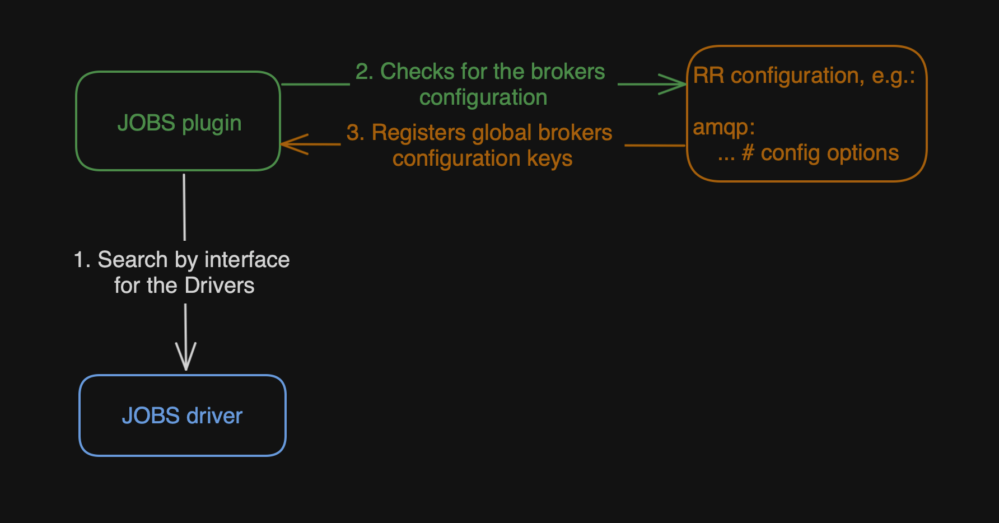

# Jobs driver

JOBS drivers are mini-plugins that are connected to the main JOBS plugin and initialized by it.

## Architecture

The Jobs plugin discovers drivers through the `Constructor` interface. The [Jobs contracts](https://github.com/roadrunner-server/api-plugins/blob/v6.0.0-beta.2/jobs/driver.go) are in `github.com/roadrunner-server/api-plugins/v6/jobs`. See [plugin migration](plugin.md#v6-migration) for the shared import and logging changes.

Constructor interface:



```go
// Constructor constructs Consumer interface. Endure abstraction.
type Constructor interface {
 // Name returns the name of the driver
 Name() string
 // DriverFromConfig constructs a driver (e.g. kafka, amqp) from the configuration using the provided configKey
 DriverFromConfig(ctx context.Context, configKey string, queue Queue, pipeline Pipeline) (Driver, error)
 // DriverFromPipeline constructs a driver (e.g. kafka, amqp) from the pipeline. All configuration is provided by the pipeline
 DriverFromPipeline(ctx context.Context, pipe Pipeline, queue Queue) (Driver, error)
}
```



Driver interface:



```go
// Driver represents the interface for a single jobs driver
type Driver interface {
 // Push pushes the job to the underlying driver
 Push(ctx context.Context, msg Message) error
 // Run starts consuming the pipeline
 Run(ctx context.Context, pipeline Pipeline) error
 // Stop stops the consumer and closes the underlying connection
 Stop(ctx context.Context) error
 // Pause pauses the jobs consuming (while still allowing job pushing)
 Pause(ctx context.Context, pipeline string) error
 // Resume resumes the consumer
 Resume(ctx context.Context, pipeline string) error
 // State returns information about the driver state
 State(ctx context.Context) (*State, error)
}
```



So every driver should implement the `Constructor` interface to be found by the JOBS plugin. Let's have a look at the methods included in the `Constructor` interface:

1. `Name() string`: This method should return a user-friendly name for the driver. It'll be used later in the pipelines `<pipeline_name>.driver` option. **It is an important option. The name here and name in the pipeline options should match.**
2. `DriverFromConfig(ctx context.Context, configKey string, queue Queue, pipeline Pipeline) (Driver, error)`: Creates a driver from configuration. RoadRunner supplies the context, configuration key, queue, and pipeline.
3. `DriverFromPipeline(ctx context.Context, pipe Pipeline, queue Queue) (Driver, error)`: Creates a driver for an RPC `jobs.Declare` call. The pipeline contains its configuration. Pass the context to backend connection and setup operations.

### Initialization

During initialization, the JOBS plugin searches for the JOBS drivers and saves them into a hashmap by the name provided by the `Name() string` method.
It is not possible to have two drivers with the same name.
Drivers here are the ones declared in the `jobs.pipelines` configuration.
RoadRunner also saves pipelines declared via configuration by their name. Pipelines can also be declared with the [`jobs.Declare`](https://github.com/roadrunner-php/jobs/blob/v4.5.0/src/Jobs.php#L26) RPC method.
If required, you may use the `Configurer` plugin to unmarshal global driver configuration, such as a connection string.




### How to create a driver for JOBS

The [sample driver](https://github.com/roadrunner-server/samples/blob/master/plugins/jobs_driver/) shows the backend structure. The examples below use the v6 contracts. Use your own module path in place of `example.com/jobs-driver`.

To create a driver for jobs, you need to create a plugin instance:



```go
package jobs_driver //nolint:revive,stylecheck

import (
    "context"
    "log/slog"

    "example.com/jobs-driver/driver"
    "github.com/roadrunner-server/api-plugins/v6/jobs"
    "github.com/roadrunner-server/errors"
)

const pluginName string = "my_awesome_driver"

var _ jobs.Constructor = (*Plugin)(nil)

type Configurer interface {
    UnmarshalKey(name string, out any) error
    Has(name string) bool
}

type Logger interface {
    NamedLogger(name string) *slog.Logger
}

type Plugin struct {
    log *slog.Logger
    cfg Configurer
}

func (p *Plugin) Init(log Logger, cfg Configurer) error {
    if !cfg.Has(pluginName) {
        return errors.E(errors.Disabled)
    }

    p.log = log.NamedLogger(pluginName)
    p.cfg = cfg
    return nil
}

func (p *Plugin) Name() string {
    return pluginName
}

func (p *Plugin) DriverFromConfig(ctx context.Context, configKey string, pq jobs.Queue, pipeline jobs.Pipeline) (jobs.Driver, error) {
    return driver.FromConfig(ctx, configKey, p.log, p.cfg, pipeline, pq)
}

func (p *Plugin) DriverFromPipeline(ctx context.Context, pipe jobs.Pipeline, pq jobs.Queue) (jobs.Driver, error) {
    return driver.FromPipeline(ctx, pipe, p.log, p.cfg, pq)
}
```



This is a simple representation of the RR plugin. It is called driver because it is attached to another controlling plugin as a pluggable extender, aka: a driver.
Keep in mind the plugin's name.

JOBS plugin will send the following data to the `Constructor` interface methods:

1. If declared via configuration (`.rr.yaml`) - `configKey`, you may use that key to unmarshal the configuration section related solely to this driver. If the driver was declared
via `jobs.Declare` RPC method, all configuration options would be stored in the `jobs.Pipeline` interface.
2. `jobs.Queue`: Priority-Queue, used to push the messages and later process by the PHP workers.
3. All other things like logger, `Configurer` plugin which will be used to get the values from the `.rr.yaml` configuration you may pass if you need them from the driver's root (e.g.: `p.log`).

Now, let's see the simplified `Driver` implementation:



```go
package driver

import (
    "context"
    "log/slog"

    "github.com/roadrunner-server/api-plugins/v6/jobs"
)

var _ jobs.Driver = (*Driver)(nil)

type Configurer interface {
    UnmarshalKey(name string, out any) error
    Has(name string) bool
}

type Driver struct {
    queue jobs.Queue
}

func FromConfig(ctx context.Context, configKey string, log *slog.Logger, cfg Configurer, pipeline jobs.Pipeline, pq jobs.Queue) (*Driver, error) {
    return &Driver{queue: pq}, nil
}

// FromPipeline initializes consumer from pipeline
func FromPipeline(ctx context.Context, pipeline jobs.Pipeline, log *slog.Logger, cfg Configurer, pq jobs.Queue) (*Driver, error) {
    return &Driver{queue: pq}, nil
}

func (d *Driver) Push(ctx context.Context, job jobs.Message) error {
    return nil
}

func (d *Driver) Run(ctx context.Context, p jobs.Pipeline) error {
    return nil
}

func (d *Driver) State(ctx context.Context) (*jobs.State, error) {
    return &jobs.State{}, nil
}

func (d *Driver) Pause(ctx context.Context, p string) error {
    return nil
}

func (d *Driver) Resume(ctx context.Context, p string) error {
    return nil
}

func (d *Driver) Stop(ctx context.Context) error {
    return nil
}
```



Remember the following things:

1. The `FromConfig` and `FromPipeline` methods are used to initialize the driver, not to start message consumption.
2. The `JOBS` plugin will automatically call the `Run` method if your pipelines are in the `jobs.consume` array.
3. For pipelines declared via the `jobs.Declare` RPC call, the `jobs.Resume` method should be called instead.

### Pushing jobs into the priority queue

To push a job into the priority queue, you need to slightly transform it to add `Ack`, `Nack`, etc. methods to it.
The [Job interface](https://github.com/roadrunner-server/api-plugins/blob/v6.0.0-beta.2/jobs/job.go) includes `jobs.Item`:



```go
import "github.com/roadrunner-server/api-plugins/v6/jobs"

// Job represents a binary heap item
type Job interface {
    jobs.Item
    // Ack acknowledges the item after processing
    Ack() error
    // Nack discards the item
    Nack() error
    // NackWithOptions discards the item with an optional requeue flag
    NackWithOptions(requeue bool, delay int) error
    // Requeue puts the message back to the queue with an optional delay
    Requeue(headers map[string][]string, delay int) error
    // Body returns the payload associated with the item
    Body() []byte
    // Context returns any meta-information associated with the item
    Context() ([]byte, error)
    // Headers return the metadata for the item
    Headers() map[string][]string
}
```



`jobs.Item` requires `ID() string`, `GroupID() string`, and `Priority() int64`. Update the driver's `Push` method to insert a `jobs.Job` into its queue:



```go
func (d *Driver) Push(_ context.Context, job jobs.Message) error {
	item := fromJob(job)
	d.queue.Insert(item)
	return nil
}

func fromJob(job jobs.Message) *Item {
	return &Item{
		Job:     job.Name(),
		Ident:   job.ID(),
		Payload: job.Payload(),
		headers: job.Headers(),
		Options: &Options{
			Priority: job.Priority(),
			Pipeline: job.GroupID(),
			Delay:    int(job.Delay()),
			AutoAck:  job.AutoAck(),
		},
	}
}
```



The `fromJob` method is needed to simply transform `jobs.Message` into a `Job`. See [link](https://github.com/roadrunner-server/samples/blob/master/plugins/jobs_driver/driver/message.go).
The rest is to implement driver-specific `Ack`, `Nack`, etc. methods.

Configuration for your jobs driver:



```yaml
version: '3'

rpc:
  listen: tcp://127.0.0.1:6001

server:
  command: "php your_php_worker.php"
  relay: "pipes"

your_global_section:
  addr: "some_connection_string"

logs:
  level: error
  encoding: console
  mode: development

jobs:
  pool:
    num_workers: 10
    allocate_timeout: 60s
    destroy_timeout: 1s

  pipelines:
    test-1:
      driver: my_awesome_driver
      config:
        priority: 1
        prefetch: 100
        # rest of the options

  consume: [ "test-1" ]
```



Examples of existing drivers: [AMQP](https://github.com/roadrunner-server/amqp), [Kafka](https://github.com/roadrunner-server/kafka), [In-Memory](https://github.com/roadrunner-server/memory), [Nats](https://github.com/roadrunner-server/nats), [SQS](https://github.com/roadrunner-server/sqs), [BoltDB](https://github.com/roadrunner-server/boltdb), [Google Pub-Sub](https://github.com/roadrunner-server/google-pub-sub)
