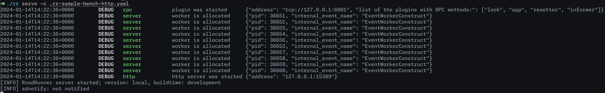

# Quick Start Guide

This guide walks you through getting started with RoadRunner. You'll learn how to install RoadRunner and configure it for your project.

## Step 1: Download RR for your platform

To begin, you need to download RR for your platform. Visit the [RR installation guide](install.md) and download the appropriate version for your operating system.

## Step 2: Install PHP

RR requires PHP to run. If you don't have PHP installed, you can download it from the [official PHP website](https://www.php.net/downloads.php) and follow the installation instructions for your operating system.

## Step 3: Create a simple configuration

Next, you need to create a simple configuration file for RR. Open a text editor and create a new file called `.rr.yaml`. Add the following content to the file:



```yaml
version: "3"

server:
  command: "php psr-worker.php"

http:
  address: 0.0.0.0:8080

# Do not use development mode in production
logs:
  level: debug
  mode: development
```




RoadRunner is not only an HTTP plugin. There are many other plugins. Find more in the [Plugins](../plugins/intro.md) section.


## Step 4: Create a simple worker

Now create a simple worker. Create a new file called `psr-worker.php` and add the following content:



```php
<?php

require __DIR__ . '/vendor/autoload.php';

use Nyholm\Psr7\Response;
use Nyholm\Psr7\Factory\Psr17Factory;

use Spiral\RoadRunner\Worker;
use Spiral\RoadRunner\Http\PSR7Worker;
$worker = Worker::create();

$factory = new Psr17Factory();

$psr7 = new PSR7Worker($worker, $factory, $factory, $factory);

while (true) {
    try {
        $request = $psr7->waitRequest();
        if ($request === null) {
            break;
        }
    } catch (\Throwable $e) {
        $psr7->respond(new Response(400));
        continue;
    }

    try {
        $psr7->respond(new Response(200, [], 'Hello RoadRunner!'));
    } catch (\Throwable $e) {
        $psr7->respond(new Response(500, [], 'Something Went Wrong!'));
        $psr7->getWorker()->error((string)$e);
    }
}
```



## Step 5: Start the server

Now start the server. You should have the following files in the current folder:

- `.rr.yaml`
- `psr-worker.php`
- `rr` binary

Then, open a terminal window in the current folder and run the following command:

```bash
./rr serve
```

Since logs are in development mode, you should see the following output:
<figure>
  <picture>
    <source srcset="image.png" media="(prefers-color-scheme: dark)">
    
  </picture>
</figure>
